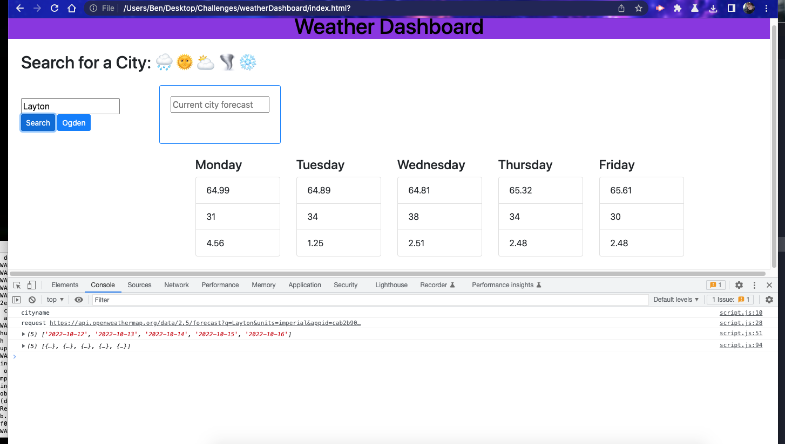

# weatherDashboard

readme.md 

# This page will display a 5 day forecast of any city you enter.
This page is set up to give you the temperature, humididty, and wind speed in the city that you search.
I have applied a weatherAPI in order to recieve the data from the different cities.
## I have saved the data from the cities searched in the local sotrage so that you may go back and look.
Each data srting was parsed so that it only pulled up the desired info for a 5 day forecase.
I utilized the help of a tutor so that my page would save and pull the data so it would display on the page.
This page will pull weather info from any city within the United States.
This page is interactive in the fact that if you type in a desired city you recieve the weather there.

https://mfarrell23.github.io/weatherDashboard/
